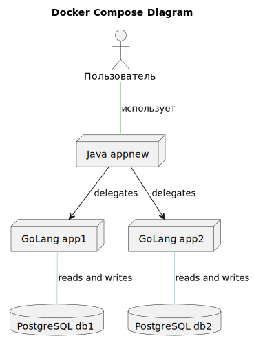
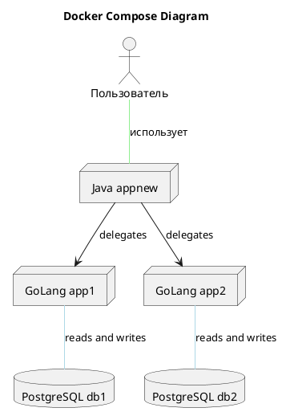
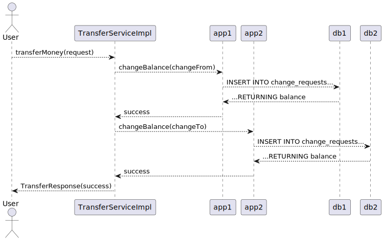
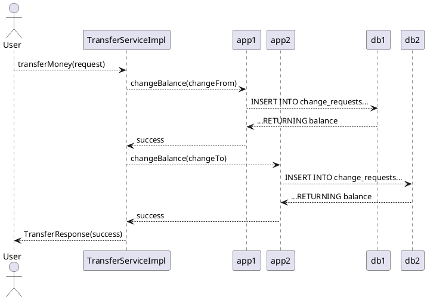

# Приложение для управления балансами аккаунтов и транзакциями между ними

| Файл | Строк кода создано моделью | Строк кода исправлено вручную | Доля ручных исправлений | КПД модели  |
| --- | --- | --- | --- | --- |
| README.md | 147 | 20 | 14% | 86% |
| Makefile | 25 | 1 | 4% | 96% |
| docker-compose.yaml | 56 | 10 | 18% | 82% |
| 1_balance.go | 42 | 4 | 10% | 90% |
| server.go | 68 | 13 | 19% | 81% |
| cmd/shard/main.go | 62 | 0 | 0% | 100% |
| cmd/testing/main.go | 64 | 13 | 20% | 80% |
| go.Dockerfile | 23 | 1 | 4% | 96% |
| go.mod | 3 | 0 | 0% | 100% |
| Application.java | 25 | 2 | 8% | 92% |
| TransferServiceImpl.java | 83 | 25 | 30% | 70% |
| build.gradle | 22 | 3 | 14% | 86% |
| java.Dockerfile | 10 | 1 | 10% | 90% |
| transfer.proto | 43 | 0 | 0% | 100% |
| balance.proto | 43 | 0 | 0% | 100% |
| __По типам артефактов__ |  |  |  |  |
| Документация | 147 | 20 | 14% | 86% |
| Скрипт сборки | 81 | 11 | 14% | 86% |
| Go | 262 | 31 | 12% | 88% |
| Java | 140 | 31 | 22% | 78% |
| Описание API | 86 | 0 | 0% | 100% |
| __Итого__ | 716 | 93 | 13% | 87% |

## Архитектура приложения

Приложение состоит из следующих сервисов, реализуемых в Docker контейнерах:

1. **db1** и **db2** - два экземпляра базы данных PostgreSQL для хранения информации о транзакциях и аккаунтах. Данные сохраняются в контейнере Docker, что позволяет иметь возможность использовать любой СУБД, но для этого приложение должно быть настроено соответственно.

2. **app1** и **app2** - два экземпляра приложения, которые реализуют сервис `balance` из файла balance.proto. Для каждого из этих сервисов настроена база данных PostgreSQL, соответствующая конфигурации в Docker Compose файле.

3. **appnew** - новое приложение, которое реализует сервис `transfer` из файла transfer.proto. Этот сервис использует другие два сервиса (**app1** и **app2**) для изменения балансов аккаунтов на основании транзакций.


<details>



</details>

## Назначение приложения

Основное назначение этого приложения - управлять балансами аккаунтов и производить между ними транзации (переводы). Баланс каждого аккаунта хранится в отдельной базе данных PostgreSQL, которая доступна для чтения и записи.

Для реализации этого назначения используются следующие технологии:

- **Docker Compose** - управление множеством Docker контейнеров, включая сервисы баз данных.
- **PostgreSQL** - хранение информации о транзакциях и аккаунтах в виде реляционной СУБД.
- **gRPC** - двусторонняя RPC (Remote Procedure Call) на основе HTTP/2, используется для вызова методов сервисов `balance` и `transfer`.
- **GoLang** - язык программирования для реализации gRPC сервисов (`app1`, `app2`).
- **Java** - язык программирования для реализации нового gRPC сервиса (`appnew`), который использует другие два сервиса.

## Процесс работы


<details>



</details>

1. `TransferServiceImpl` в Java принимает запрос на перевод денег с одного аккаунта на другой (`appnew`).
2. Этот сервис определяет, какому экземпляру `balance` (`app1` или `app2`) относится отправитель и получатель транзакции.
3. Затем `TransferServiceImpl` в Java делегирует запросы на изменение баланса аккаунтов (`changeBalance` RPC методы) другим сервисам (`app1` или `app2`).
4. Каждый из этих `balance` сервисов обращается к своей PostgreSQL базе данных и создает транзакцию, которая регистрирует операцию перевода денег (или увеличения или уменьшения баланса) в соответствии с полученной информации.
5. Результаты этих транзакций возвращаются обратно `TransferServiceImpl` и ему известно, удалось ли изменить баланс или произошла ошибка. 

Таким образом, это приложение может работать в режиме репликации для обеспечения доступности и надежности, а также увеличивать масштабируемость системы.

## Ручное тестирование приложения gRPC 

Для ручного тестирования gRPC-приложения, вам потребуются два основных инструмента: `grpcurl` и `docker-compose`. Все команды будут запускаться в консоли.

### 1. Запуск приложения с помощью Docker Compose

Вначале вам нужно создать файл `docker-compose.yaml`, который уже был предоставлен в вопросе. Переместитесь в директорию проекта и запустите следующие команды:

```bash
docker-compose up -d
```

После этого ваше приложение должно стать доступным для gRPC. Обратите внимание, что на данном этапе база данных уже создана и заполнена начальными данными.

### 2. Тестирование метода ChangeBalance

Для тестирования `ChangeBalance` вам нужен `grpcurl`, который не входит в состав официального пакета Docker и доступен для установки отдельно. 

Ваша задача - изменить баланс аккаунта с ID=1 на сумму +500:

```bash
grpcurl -d '{"accountId":1, "amount":500, "transactionId": 1}' -plaintext localhost:5001 balance.Balance/ChangeBalance
```

После выполнения этой команды баланс аккаунта с ID=1 должен увеличиться на 500, и ваша gRPC-ответ должен быть следующим:

```json
{ "success": true }
```

### 3. Тестирование метода GetAccountData

Теперь вы можете получить данные о балансе аккаунта с ID=1:

```bash
grpcurl -d '{"accountId":1}' -plaintext localhost:5001 balance.Balance/GetAccountData
```

Ваша gRPC-ответ должен быть следующим:

```json
{ "balance": 500, "transactions": [{"id":1,"amount":500}] }
```

### 4. Тестирование метода TransferMoney

Теперь протестируем метод `TransferMoney`:

```bash
grpcurl -d '{"fromAccountId":1, "toAccountId":2, "amount":500}' -plaintext localhost:5002 transfer.Transfer/TransferMoney
```

После этого баланс аккаунта с ID=1 (откуда переводится денежные средства) должен уменьшиться на 500, а баланс аккаунта с ID=2 (на который переводятся деньги) должен увеличиться на 500.

### 5. Тестирование метода GetAccountData после TransferMoney

Теперь вы можете получить данные о балансе аккаунта с ID=1:

```bash
grpcurl -d '{"accountId":1}' -plaintext localhost:5002 transfer.Transfer/GetAccountData
```

Ваша gRPC-ответ должен быть следующим:

```json
{ "balance": 0, "transactions": [{"id":1,"amount":500}, {"id":2,"amount":-500}] }
```

и для аккаунта с ID=2:

```bash
grpcurl -d '{"accountId":2}' -plaintext localhost:5002 transfer.Transfer/GetAccountData
```

Ваша gRPC-ответ должен быть следующим:

```json
{ "balance": 500, "transactions": [{"id":2,"amount":500}] }
